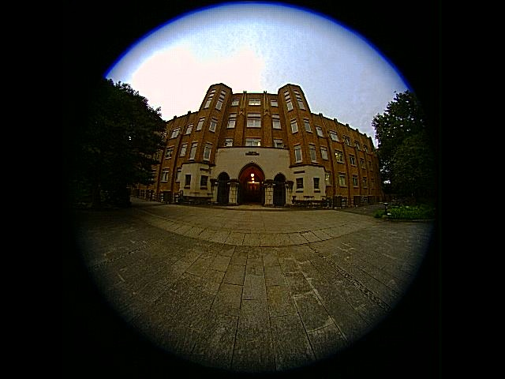
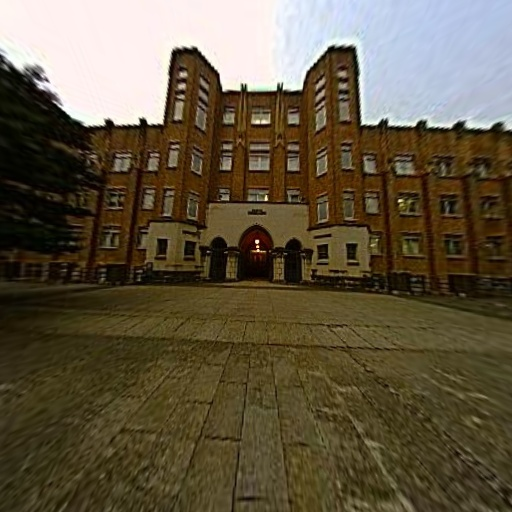

# Double Sphere Camera Model

Unofficial Python library of Double Sphere Camera Model for fisheye cameras.

## Project tree
```text
.
├── assets
│   ├── images
│   │   ├── equirectangular.jpg
│   │   ├── perspective.jpg
│   │   └── sample.jpg
│   └── jsons
│       ├── calibration.json
│       ├── ICMS-E.json
│       └── ICMS-F.json
├── dscamera
│   ├── __init__.py
│   └── camera.py
├── tests
│   ├── test_projection.py
│   ├── test_basic.py
│   ├── image_rectification_pytorch.py
│   └── image_rectification.py
├── demo.py
└── README.md
```

## Create DCCM conda environment
```bash
conda create --name DCCM python=3.11 -y
```

```bash
pip install opencv-python torch torchvision pytest
```

## Run demo
```bash
python demo.py --source [VIDEO_PATH] --json-path [PARAMETERS_JSON] --focal [ZOOM_VALUE] --save
```

## Run fisheye image rectifications demo (outside dir)
```bash
python tests/image_rectification.py
```

## Camera calibration
Please use [Basalt](https://vision.in.tum.de/research/vslam/basalt) for fisheye camera calibration. The detail instruction is available [here](https://gitlab.com/VladyslavUsenko/basalt/blob/master/doc/Calibration.md).

## Example
Please check `assets` folder for fisheye image rectifications.

Input `fisheye` image:



Output `perspective` image:



Output `equirectangular` image:


