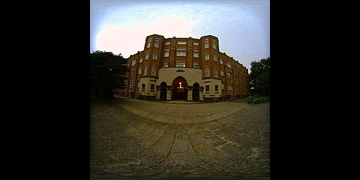

# Double Sphere Camera Model

Unofficial Python library of Double Sphere Camera Model for fisheye cameras.

## Create DCCM conda environment
```bash
$ conda create --name DCCM python=3.11 -y
```

```bash
$ pip install opencv-python torch torchvision pytest
```

## Run demo
```bash
$ python demo.py --source [VIDEO_PATH] --device [CPU/CUDA] --save --deep-insight
```

## Camera calibration
Please use [Basalt](https://vision.in.tum.de/research/vslam/basalt) for fisheye camera calibration. The detail instruction is available [here](https://gitlab.com/VladyslavUsenko/basalt/blob/master/doc/Calibration.md).

## Example
Please check `assets` folder for fisheye image rectifications.

Input fisheye image:


Output perspective image:


Output equirectangular image:


